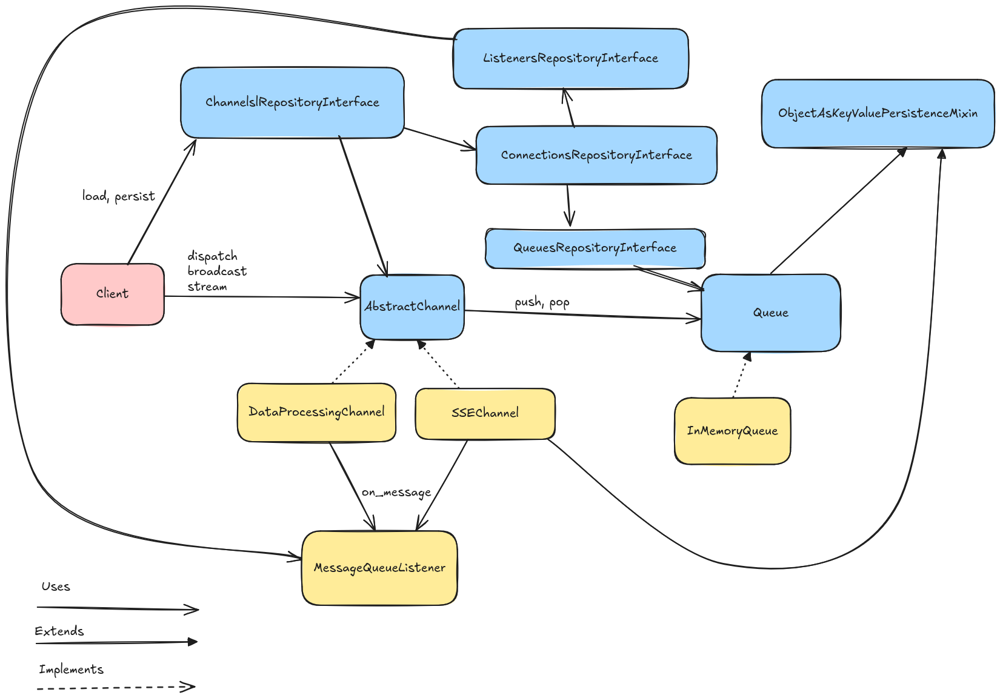

Overview
========

thanks a lot https://excalidraw.com !!

Entities
========
.. automodule:: eric_sse.message
    :members:
    :undoc-members:
    :member-order: bysource

.. automodule:: eric_sse.entities
    :members:
    :undoc-members:
    :exclude-members: NEXT_ID
    :member-order: bysource

Prefab channels and listeners
=============================
.. automodule:: eric_sse.prefabs
    :undoc-members:
    :members:
    :show-inheritance:
    :member-order: bysource

Prefab servers and clients
==========================
.. automodule:: eric_sse.servers
    :exclude-members: NEXT_ID
    :members:
.. automodule:: eric_sse.clients
    :undoc-members:
    :members:
    :member-order: bysource

Queues
======
.. automodule:: eric_sse.queue
    :members: AbstractMessageQueueFactory, InMemoryMessageQueueFactory
    :undoc-members:
    :member-order: bysource
    :show-inheritance:

Exceptions
==========
.. automodule:: eric_sse.exception
    :members:

