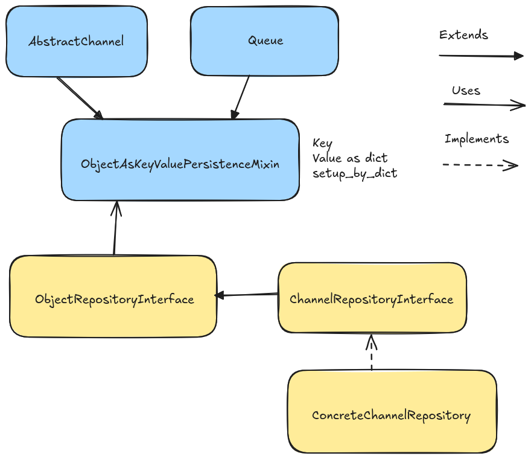
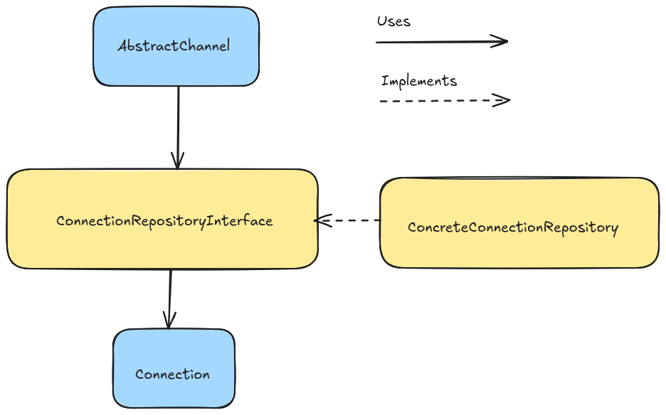

Persistence
===========

**Channels**

**Connections**

Abstractions
============
.. automodule:: eric_sse.persistence
    :members: KvStorageEngine, ObjectAsKeyValuePersistenceMixin
    :undoc-members:
    :member-order: bysource
    :show-inheritance:

.. automodule:: eric_sse.interfaces
    :members: ListenerRepositoryInterface, QueueRepositoryInterface, ConnectionRepositoryInterface, ChannelRepositoryInterface
    :undoc-members:
    :member-order: bysource
    :show-inheritance:

In memory implementations
=========================
.. automodule:: eric_sse.inmemory
    :members:
    :show-inheritance:
    :member-order: bysource

Implementation for serializable objects
=======================================
.. automodule:: eric_sse.serializable
    :undoc-members:
    :members:
    :show-inheritance:
    :member-order: bysource