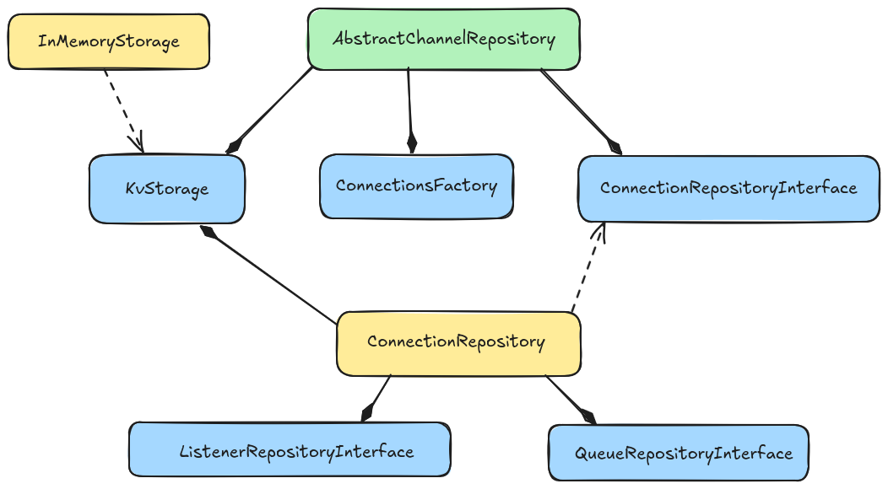

Persistence
===========

Base classes for channels and connections repositories.
The main idea is that a repository relies on some KV storage engine abstraction, and uses it for storing its own configuration, and its correspondant composites repositories to build final objects to return.

To build a persistence layer is needed to provide an implementation to one or more of above abstractions, and use them to build a custom ChannelRepository

`Here <https://github.com/laxertu/eric-redis-queues/blob/master/eric_redis_queues/repository.py>`_ is a possible Redis implementation

Base repositories
=================
.. automodule:: eric_sse.repository
    :undoc-members:
    :members:
    :show-inheritance:
    :member-order: bysource

Interoperability
================
.. automodule:: eric_sse.interfaces
    :members: ListenerRepositoryInterface, QueueRepositoryInterface, ConnectionRepositoryInterface, ChannelRepositoryInterface
    :undoc-members:
    :member-order: bysource
    :show-inheritance:
