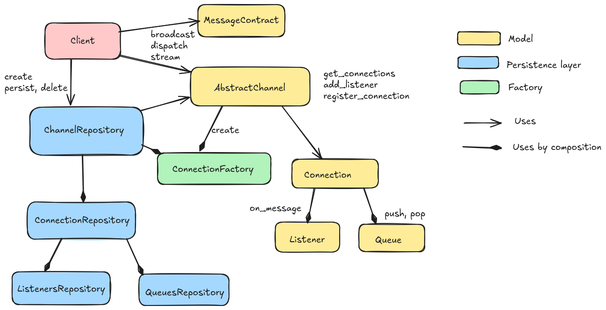

<a id="reference"></a>

# Reference



thanks a lot [https://excalidraw.com](https://excalidraw.com) !!

<a id="module-eric_sse.message"></a>

<a id="entities"></a>

# Entities

<a id="eric_sse.message.MessageContract"></a>

### *class* MessageContract

Bases: `ABC`

Contract class for messages

A message is just a container of information identified by a type.
For validation purposes you can override its [`on_message()`](#eric_sse.listener.MessageQueueListener.on_message) method.

<a id="eric_sse.message.MessageContract.type"></a>

#### *abstract property* type *: str*

Message type

<a id="eric_sse.message.MessageContract.payload"></a>

#### *abstract property* payload *: dict | list | str | int | float | None*

Message payload

<a id="eric_sse.message.Message"></a>

### *class* Message

Bases: [`MessageContract`](#eric_sse.message.MessageContract)

Models a simple message

<a id="eric_sse.message.Message.__init__"></a>

#### \_\_init_\_(msg_type, msg_payload=None)

* **Parameters:**
  * **msg_type** (*str*)
  * **msg_payload** (*dict* *|* *list* *|* *str* *|* *int* *|* *float* *|* *None*)
* **Return type:**
  None

<a id="eric_sse.message.Message.type"></a>

#### *property* type *: str*

Message type

<a id="eric_sse.message.Message.payload"></a>

#### *property* payload *: dict | list | str | int | float | None*

Message payload

<a id="eric_sse.message.UniqueMessage"></a>

### *class* UniqueMessage

Bases: [`MessageContract`](#eric_sse.message.MessageContract)

Messages plus an unique identifier

<a id="eric_sse.message.UniqueMessage.__init__"></a>

#### \_\_init_\_(message_id, message, sender_id=None)

* **Parameters:**
  * **message_id** (*str*)
  * **message** ([*MessageContract*](#eric_sse.message.MessageContract))
  * **sender_id** (*str* *|* *None*)
* **Return type:**
  None

<a id="eric_sse.message.UniqueMessage.id"></a>

#### *property* id *: str*

Unique message identifier

<a id="eric_sse.message.UniqueMessage.type"></a>

#### *property* type *: str*

Message type

<a id="eric_sse.message.UniqueMessage.sender_id"></a>

#### *property* sender_id *: str*

Returns the id of the listener that sent the message

<a id="eric_sse.message.UniqueMessage.payload"></a>

#### *property* payload *: dict | list | str | int | float | None*

Message payload

<a id="eric_sse.message.SignedMessage"></a>

### *class* SignedMessage

Bases: [`Message`](#eric_sse.message.Message)

Message plus sender id

<a id="eric_sse.message.SignedMessage.__init__"></a>

#### \_\_init_\_(sender_id, msg_type, msg_payload=None)

* **Parameters:**
  * **sender_id** (*str*)
  * **msg_type** (*str*)
  * **msg_payload** (*dict* *|* *list* *|* *str* *|* *int* *|* *float* *|* *None*)

<a id="eric_sse.message.SignedMessage.sender_id"></a>

#### *property* sender_id *: str*

Returns the id of the listener that sent the message

<a id="module-eric_sse.connection"></a>

<a id="eric_sse.connection.Connection"></a>

### *class* Connection

Bases: `object`

A connection is just a listener and its related message queue

* **Parameters:**
  * **listener** ([*MessageQueueListener*](#eric_sse.listener.MessageQueueListener))
  * **queue** ([*Queue*](#eric_sse.queues.Queue))

<a id="eric_sse.connection.Connection.__init__"></a>

#### \_\_init_\_(listener, queue, id='0658a107-8c5f-4924-a3d8-604db5ca1cbe')

* **Parameters:**
  * **listener** ([*MessageQueueListener*](#eric_sse.listener.MessageQueueListener))
  * **queue** ([*Queue*](#eric_sse.queues.Queue))
  * **id** (*str*)
* **Return type:**
  None

<a id="eric_sse.connection.PersistableConnection"></a>

### *class* PersistableConnection

Bases: [`Connection`](#eric_sse.connection.Connection)

<a id="module-eric_sse.entities"></a>

<a id="channels-and-listeners"></a>

# Channels and listeners

<a id="eric_sse.entities.AbstractChannel"></a>

### *class* AbstractChannel

Base class for channels.

Provides functionalities for listeners and message delivery management.

**Important** When using persistence layer you have to call to **load_persisted_data()** method just after object creation.

`InMemoryConnectionRepository` is the default implementation used for **connections_repository** parameter.

see [`SSEChannel`](#eric_sse.prefabs.SSEChannel)

* **Parameters:**
  * **stream_delay_seconds** (*int*) – Wait time in seconds between message delivery.
  * **channel_id** (*str*) – Optionally sets the channel id. **IMPORTANT** by using this parameter, client is responsible for guaranteeing channel id uniqueness

<a id="eric_sse.entities.AbstractChannel.__init__"></a>

#### \_\_init_\_(stream_delay_seconds=0, channel_id=None)

* **Parameters:**
  * **stream_delay_seconds** (*int*)
  * **channel_id** (*str* *|* *None*)

<a id="eric_sse.entities.AbstractChannel.id"></a>

#### *property* id *: str*

Unique identifier for this channel, it can be set by **channel_id** constructor parameter

<a id="eric_sse.entities.AbstractChannel.adapt"></a>

#### *abstract* adapt(msg)

Models output of channel streams

* **Parameters:**
  **msg** ([*MessageContract*](#eric_sse.message.MessageContract))
* **Return type:**
  *Any*

<a id="eric_sse.entities.AbstractChannel.message_stream"></a>

#### *async* message_stream(listener)

Entry point for message streaming

A message with type = ‘error’ is yield on invalid listener

* **Parameters:**
  **listener** ([*MessageQueueListener*](#eric_sse.listener.MessageQueueListener))
* **Return type:**
  *AsyncIterable*[*Any*]

<a id="eric_sse.entities.AbstractChannel.add_listener"></a>

#### add_listener()

Add the default listener and creates corresponding queue

* **Return type:**
  [*MessageQueueListener*](#eric_sse.listener.MessageQueueListener)

<a id="eric_sse.entities.AbstractChannel.register_connection"></a>

#### register_connection(listener, queue)

Registers a Connection with listener and queue without persistence

* **Parameters:**
  * **listener** ([*MessageQueueListener*](#eric_sse.listener.MessageQueueListener))
  * **queue** ([*Queue*](#eric_sse.queues.Queue))

<a id="eric_sse.entities.AbstractChannel.remove_listener"></a>

#### remove_listener(listener_id)

* **Parameters:**
  **listener_id** (*str*)

<a id="eric_sse.entities.AbstractChannel.deliver_next"></a>

#### deliver_next(listener_id)

Returns next message for given listener id.

Raises a NoMessagesException if queue is empty

* **Parameters:**
  **listener_id** (*str*)
* **Return type:**
  [*MessageContract*](#eric_sse.message.MessageContract)

<a id="eric_sse.entities.AbstractChannel.dispatch"></a>

#### dispatch(listener_id, msg)

Adds a message to listener’s queue

* **Parameters:**
  * **listener_id** (*str*)
  * **msg** ([*MessageContract*](#eric_sse.message.MessageContract))

<a id="eric_sse.entities.AbstractChannel.broadcast"></a>

#### broadcast(msg)

Enqueue a message to all listeners

* **Parameters:**
  **msg** ([*MessageContract*](#eric_sse.message.MessageContract))

<a id="eric_sse.entities.AbstractChannel.get_listener"></a>

#### get_listener(listener_id)

* **Parameters:**
  **listener_id** (*str*)
* **Return type:**
  [*MessageQueueListener*](#eric_sse.listener.MessageQueueListener)

<a id="eric_sse.entities.AbstractChannel.watch"></a>

#### *async* watch()

* **Return type:**
  *AsyncIterable*[*Any*]

<a id="eric_sse.entities.AbstractChannel.get_listeners_ids"></a>

#### get_listeners_ids()

* **Return type:**
  list[str]

<a id="module-eric_sse.listener"></a>

<a id="eric_sse.listener.MessageQueueListener"></a>

### *class* MessageQueueListener

Base class for listeners.

Optionally you can override on_message method if you need to inject code at message delivery time.

<a id="eric_sse.listener.MessageQueueListener.on_message"></a>

#### on_message(msg)

Event handler. It executes when a message is delivered to client

* **Parameters:**
  **msg** ([*MessageContract*](#eric_sse.message.MessageContract))
* **Return type:**
  None

<a id="eric_sse.listener.MessageQueueListener.start"></a>

#### start()

* **Return type:**
  None

<a id="eric_sse.listener.MessageQueueListener.stop"></a>

#### stop()

* **Return type:**
  None

<a id="eric_sse.listener.MessageQueueListener.is_running"></a>

#### is_running()

* **Return type:**
  bool

<a id="eric_sse.listener.PersistableListener"></a>

### *class* PersistableListener

Gives KV persistence support to MessageQueueListener.

<a id="eric_sse.listener.PersistableListener.kv_key"></a>

#### *property* kv_key *: str*

The key to use when persisting object

<a id="eric_sse.listener.PersistableListener.kv_setup_values_as_dict"></a>

#### *property* kv_setup_values_as_dict *: dict*

Returns value that will be persisted as a dictionary.

<a id="eric_sse.listener.PersistableListener.kv_setup_by_dict"></a>

#### kv_setup_by_dict(setup)

Does necessary post-creation setup of object given its persisted values

* **Parameters:**
  **setup** (*dict*)

<a id="eric_sse.listener.PersistableListener.kv_constructor_params_as_dict"></a>

#### *property* kv_constructor_params_as_dict *: dict*

Class constructor parameters as dict

<a id="persistence"></a>

# Persistence

**Channels**


**Connections**


<a id="module-eric_sse.persistence"></a>

This module is intended to those who want to create their own persistence layer

A **Redis** concrete implementation of interfaces is available at  [eric-redis-queues package source](https://github.com/laxertu/eric-redis-queues/blob/master/eric_redis_queues/__init__.py).

Here is a [Basic example](https://github.com/laxertu/eric/blob/master/examples/use_cases/basic.py) of integration.

**Writing a custom persistence layer**

You’ll need to implement the following interfaces:

**Channels**

* `ChannelRepositoryInterface`
* You’ll need to define a channel that implements `PersistableChannel` if [`SSEChannel`](#eric_sse.prefabs.SSEChannel) do not suit with your requirements
* For **MessageQueueListener** support you can extend or directly use `PersistableListener`.

**Connections**

* `PersistableQueue`
* `ConnectionRepositoryInterface`

<a id="eric_sse.persistence.ObjectAsKeyValuePersistenceMixin"></a>

### *class* ObjectAsKeyValuePersistenceMixin

Bases: `ABC`

Adds KV persistence support.

By implementing this abstract mixin should be possible to persist every object that is not directly
serializable by pickle, for example, if your Queues implementation wraps some incompatible dependency, e.g. a Redis client.

For this reason, the idea is that dict values should be serializable by pickle too.

see [`importlib_create_instance()`](#eric_sse.persistence.importlib_create_instance)

<a id="eric_sse.persistence.ObjectAsKeyValuePersistenceMixin.dict"></a>

#### *property* dict

<a id="eric_sse.persistence.ObjectAsKeyValuePersistenceMixin.kv_key"></a>

#### *abstract property* kv_key *: str*

The key to use when persisting object

<a id="eric_sse.persistence.ObjectAsKeyValuePersistenceMixin.kv_setup_values_as_dict"></a>

#### *abstract property* kv_setup_values_as_dict *: <property object at 0x77bf980ebf10>*

Returns value that will be persisted as a dictionary.

<a id="eric_sse.persistence.ObjectAsKeyValuePersistenceMixin.kv_setup_by_dict"></a>

#### *abstract* kv_setup_by_dict(setup)

Does necessary post-creation setup of object given its persisted values

* **Parameters:**
  **setup** ( *<property object at 0x77bf980ebf10>*)

<a id="eric_sse.persistence.ObjectAsKeyValuePersistenceMixin.kv_class_absolute_path"></a>

#### *property* kv_class_absolute_path *: str*

Returns class full path as string

<a id="eric_sse.persistence.ObjectAsKeyValuePersistenceMixin.kv_constructor_params_as_dict"></a>

#### *abstract property* kv_constructor_params_as_dict *: <property object at 0x77bf980ebf10>*

Class constructor parameters as dict

<a id="eric_sse.persistence.KvStorageEngine"></a>

### *class* KvStorageEngine

Bases: `ABC`

<a id="eric_sse.persistence.KvStorageEngine.fetch_by_prefix"></a>

#### *abstract* fetch_by_prefix(prefix)

* **Parameters:**
  **prefix** (*str*)
* **Return type:**
  *Iterable*[any]

<a id="eric_sse.persistence.KvStorageEngine.fetch_all"></a>

#### *abstract* fetch_all()

* **Return type:**
  *Iterable*[any]

<a id="eric_sse.persistence.KvStorageEngine.upsert"></a>

#### *abstract* upsert(key, value)

* **Parameters:**
  * **key** (*str*)
  * **value** (*any*)

<a id="eric_sse.persistence.KvStorageEngine.fetch_one"></a>

#### *abstract* fetch_one(key)

* **Parameters:**
  **key** (*str*)
* **Return type:**
  any

<a id="eric_sse.persistence.KvStorageEngine.delete"></a>

#### *abstract* delete(key)

* **Parameters:**
  **key** (*str*)

<a id="eric_sse.persistence.importlib_create_instance"></a>

### importlib_create_instance(class_full_path, constructor_params, setup_values)

Creates a persistable class instance given a persisted value and executes its setup_by_dict method

see `setup_by_dict()`

* **Parameters:**
  * **class_full_path** (*str*)
  * **constructor_params** (*dict*)
  * **setup_values** (*dict*)
* **Return type:**
  [*ObjectAsKeyValuePersistenceMixin*](#eric_sse.persistence.ObjectAsKeyValuePersistenceMixin)

<a id="module-eric_sse.interfaces"></a>

<a id="eric_sse.interfaces.ListenerRepositoryInterface"></a>

### *class* ListenerRepositoryInterface

Bases: `ABC`

<a id="eric_sse.interfaces.ListenerRepositoryInterface.load"></a>

#### *abstract* load(listener_id)

* **Parameters:**
  **listener_id** (*str*)
* **Return type:**
  [*MessageQueueListener*](#eric_sse.listener.MessageQueueListener)

<a id="eric_sse.interfaces.ListenerRepositoryInterface.persist"></a>

#### *abstract* persist(listener)

* **Parameters:**
  **listener** ([*MessageQueueListener*](#eric_sse.listener.MessageQueueListener))

<a id="eric_sse.interfaces.ListenerRepositoryInterface.delete"></a>

#### *abstract* delete(listener_id)

* **Parameters:**
  **listener_id** (*str*)

<a id="eric_sse.interfaces.QueueRepositoryInterface"></a>

### *class* QueueRepositoryInterface

Bases: `ABC`

<a id="eric_sse.interfaces.QueueRepositoryInterface.load"></a>

#### *abstract* load(queue_id)

* **Parameters:**
  **queue_id** (*str*)
* **Return type:**
  [*Queue*](#eric_sse.queues.Queue)

<a id="eric_sse.interfaces.QueueRepositoryInterface.persist"></a>

#### *abstract* persist(queue)

* **Parameters:**
  **queue** ([*Queue*](#eric_sse.queues.Queue))

<a id="eric_sse.interfaces.QueueRepositoryInterface.delete"></a>

#### *abstract* delete(queue_id)

* **Parameters:**
  **queue_id** (*str*)

<a id="eric_sse.interfaces.ConnectionRepositoryInterface"></a>

### *class* ConnectionRepositoryInterface

Bases: `ABC`

<a id="eric_sse.interfaces.ConnectionRepositoryInterface.load_all"></a>

#### *abstract* load_all(channel_id)

* **Parameters:**
  **channel_id** (*str*)
* **Return type:**
  *Iterable*[[*Connection*](#eric_sse.connection.Connection)]

<a id="eric_sse.interfaces.ConnectionRepositoryInterface.load_one"></a>

#### *abstract* load_one(connection_id)

* **Parameters:**
  **connection_id** (*str*)
* **Return type:**
  [*Connection*](#eric_sse.connection.Connection)

<a id="eric_sse.interfaces.ConnectionRepositoryInterface.persist"></a>

#### *abstract* persist(connection)

* **Parameters:**
  **connection** ([*Connection*](#eric_sse.connection.Connection))

<a id="eric_sse.interfaces.ConnectionRepositoryInterface.delete"></a>

#### *abstract* delete(connection_id)

* **Parameters:**
  **connection_id** (*str*)

<a id="eric_sse.interfaces.ChannelRepositoryInterface"></a>

### *class* ChannelRepositoryInterface

Bases: `ABC`

<a id="eric_sse.interfaces.ChannelRepositoryInterface.load_all"></a>

#### *abstract* load_all()

* **Return type:**
  *Iterable*[[*AbstractChannel*](#eric_sse.entities.AbstractChannel)]

<a id="eric_sse.interfaces.ChannelRepositoryInterface.load_one"></a>

#### *abstract* load_one(channel_id)

* **Parameters:**
  **channel_id** (*str*)
* **Return type:**
  [*AbstractChannel*](#eric_sse.entities.AbstractChannel)

<a id="eric_sse.interfaces.ChannelRepositoryInterface.persist"></a>

#### *abstract* persist(channel)

* **Parameters:**
  **channel** ([*AbstractChannel*](#eric_sse.entities.AbstractChannel))

<a id="eric_sse.interfaces.ChannelRepositoryInterface.delete"></a>

#### *abstract* delete(channel_id)

* **Parameters:**
  **channel_id** (*str*)

<a id="module-eric_sse.serializable"></a>

If you have to persist a serializable participant, you can use this module if correspondant storage engine supports its format

see `InMemoryChannelRepository`

<a id="eric_sse.serializable.ListenerRepository"></a>

### *class* ListenerRepository

Bases: [`ListenerRepositoryInterface`](#eric_sse.interfaces.ListenerRepositoryInterface)

<a id="eric_sse.serializable.ListenerRepository.__init__"></a>

#### \_\_init_\_(storage_engine)

* **Parameters:**
  **storage_engine** ([*KvStorageEngine*](#eric_sse.persistence.KvStorageEngine))

<a id="eric_sse.serializable.ListenerRepository.load"></a>

#### load(listener_id)

* **Parameters:**
  **listener_id** (*str*)
* **Return type:**
  [*MessageQueueListener*](#eric_sse.listener.MessageQueueListener)

<a id="eric_sse.serializable.ListenerRepository.persist"></a>

#### persist(listener)

* **Parameters:**
  **listener** ([*MessageQueueListener*](#eric_sse.listener.MessageQueueListener))

<a id="eric_sse.serializable.ListenerRepository.delete"></a>

#### delete(listener_id)

* **Parameters:**
  **listener_id** (*str*)

<a id="eric_sse.serializable.QueueRepository"></a>

### *class* QueueRepository

Bases: [`QueueRepositoryInterface`](#eric_sse.interfaces.QueueRepositoryInterface)

<a id="eric_sse.serializable.QueueRepository.__init__"></a>

#### \_\_init_\_(storage_engine)

* **Parameters:**
  **storage_engine** ([*KvStorageEngine*](#eric_sse.persistence.KvStorageEngine))

<a id="eric_sse.serializable.QueueRepository.load"></a>

#### load(queue_id)

* **Parameters:**
  **queue_id** (*str*)
* **Return type:**
  [*Queue*](#eric_sse.queues.Queue)

<a id="eric_sse.serializable.QueueRepository.persist"></a>

#### persist(queue)

* **Parameters:**
  **queue** ([*Queue*](#eric_sse.queues.Queue))

<a id="eric_sse.serializable.QueueRepository.delete"></a>

#### delete(queue_id)

* **Parameters:**
  **queue_id** (*str*)

<a id="eric_sse.serializable.ConnectionRepository"></a>

### *class* ConnectionRepository

Bases: [`ConnectionRepositoryInterface`](#eric_sse.interfaces.ConnectionRepositoryInterface)

<a id="eric_sse.serializable.ConnectionRepository.__init__"></a>

#### \_\_init_\_(storage_engine)

* **Parameters:**
  **storage_engine** ([*KvStorageEngine*](#eric_sse.persistence.KvStorageEngine))

<a id="eric_sse.serializable.ConnectionRepository.load_all"></a>

#### load_all(channel_id)

* **Parameters:**
  **channel_id** (*str*)
* **Return type:**
  *Iterable*[[*Connection*](#eric_sse.connection.Connection)]

<a id="eric_sse.serializable.ConnectionRepository.load_one"></a>

#### load_one(connection_id)

* **Parameters:**
  **connection_id** (*str*)
* **Return type:**
  [*Connection*](#eric_sse.connection.Connection)

<a id="eric_sse.serializable.ConnectionRepository.persist"></a>

#### persist(connection)

* **Parameters:**
  **connection** ([*Connection*](#eric_sse.connection.Connection))

<a id="eric_sse.serializable.ConnectionRepository.delete"></a>

#### delete(connection_id)

* **Parameters:**
  **connection_id** (*str*)

<a id="eric_sse.serializable.ChannelRepository"></a>

### *class* ChannelRepository

Bases: [`ChannelRepositoryInterface`](#eric_sse.interfaces.ChannelRepositoryInterface)

<a id="eric_sse.serializable.ChannelRepository.__init__"></a>

#### \_\_init_\_(storage_engine)

* **Parameters:**
  **storage_engine** ([*KvStorageEngine*](#eric_sse.persistence.KvStorageEngine))

<a id="eric_sse.serializable.ChannelRepository.load_all"></a>

#### load_all()

* **Return type:**
  *Iterable*[[*AbstractChannel*](#eric_sse.entities.AbstractChannel)]

<a id="eric_sse.serializable.ChannelRepository.load_one"></a>

#### load_one(channel_id)

* **Parameters:**
  **channel_id** (*str*)
* **Return type:**
  [*AbstractChannel*](#eric_sse.entities.AbstractChannel)

<a id="eric_sse.serializable.ChannelRepository.persist"></a>

#### persist(channel)

* **Parameters:**
  **channel** ([*AbstractChannel*](#eric_sse.entities.AbstractChannel))

<a id="eric_sse.serializable.ChannelRepository.delete"></a>

#### delete(channel_id)

* **Parameters:**
  **channel_id** (*str*)

<a id="module-eric_sse.prefabs"></a>

<a id="prefab-channels-and-listeners"></a>

# Prefab channels and listeners

<a id="eric_sse.prefabs.PersistableChannel"></a>

### *class* PersistableChannel

Bases: [`AbstractChannel`](#eric_sse.entities.AbstractChannel), [`ObjectAsKeyValuePersistenceMixin`](#eric_sse.persistence.ObjectAsKeyValuePersistenceMixin), `ABC`

<a id="eric_sse.prefabs.SSEChannel"></a>

### *class* SSEChannel

Bases: [`PersistableChannel`](#eric_sse.prefabs.PersistableChannel)

SSE streaming channel.
See [Mozilla docs](https://developer.mozilla.org/en-US/docs/Web/API/Server-sent_events/Using_server-sent_events#event_stream_format)

Currently, ‘id’ field is not supported.

<a id="eric_sse.prefabs.SSEChannel.__init__"></a>

#### \_\_init_\_(stream_delay_seconds=0, retry_timeout_milliseconds=5, channel_id=None)

* **Parameters:**
  * **stream_delay_seconds** (*int*)
  * **retry_timeout_milliseconds** (*int*)
  * **channel_id** (*str* *|* *None*)

<a id="eric_sse.prefabs.SSEChannel.kv_key"></a>

#### *property* kv_key *: str*

The key to use when persisting object

<a id="eric_sse.prefabs.SSEChannel.kv_setup_values_as_dict"></a>

#### *property* kv_setup_values_as_dict *: dict*

Returns value that will be persisted as a dictionary.

<a id="eric_sse.prefabs.SSEChannel.kv_constructor_params_as_dict"></a>

#### *property* kv_constructor_params_as_dict *: dict*

Class constructor parameters as dict

<a id="eric_sse.prefabs.SSEChannel.kv_setup_by_dict"></a>

#### kv_setup_by_dict(setup)

Does necessary post-creation setup of object given its persisted values

* **Parameters:**
  **setup** (*dict*)

<a id="eric_sse.prefabs.SSEChannel.adapt"></a>

#### adapt(msg)

SSE adapter.

Returns:

```default
{
    "event": "message type",
    "retry": "channel time out",
    "data": "original payload"
}
```

* **Parameters:**
  **msg** ([*MessageContract*](#eric_sse.message.MessageContract))
* **Return type:**
  dict

<a id="eric_sse.prefabs.DataProcessingChannel"></a>

### *class* DataProcessingChannel

Bases: [`AbstractChannel`](#eric_sse.entities.AbstractChannel)

Channel intended for concurrent processing of data.

Relies on [concurrent.futures.Executor](https://docs.python.org/3/library/concurrent.futures.html#concurrent.futures.Executor).
Just override **adapt** method to control output returned to clients

MESSAGE_TYPE_CLOSED type is intended as end of stream. It should be considered as a reserved Message type.

<a id="eric_sse.prefabs.DataProcessingChannel.__init__"></a>

#### \_\_init_\_(max_workers, stream_delay_seconds=0, executor_class=<class 'concurrent.futures.thread.ThreadPoolExecutor'>)

* **Parameters:**
  * **max_workers** (*int*) – Num of workers to use
  * **stream_delay_seconds** (*int*) – Can be used to limit response rate of streaming. Only applies to message_stream calls.
  * **executor_class** (*type*) – The constructor of some Executor class. Defaults to  [ThreadPoolExecutor](https://docs.python.org/3/library/concurrent.futures.html#concurrent.futures.ThreadPoolExecutor).

<a id="eric_sse.prefabs.DataProcessingChannel.process_queue"></a>

#### *async* process_queue(listener)

Performs queue processing of a given listener, returns an AsyncIterable of dictionaries containing message process result. See **adapt** method

* **Parameters:**
  **listener** ([*MessageQueueListener*](#eric_sse.listener.MessageQueueListener))
* **Return type:**
  *AsyncIterable*[dict]

<a id="eric_sse.prefabs.DataProcessingChannel.adapt"></a>

#### adapt(msg)

Returns a dictionary in the following format:

```default
{
    "event": message type
    "data": message payload
}
```

* **Parameters:**
  **msg** ([*MessageContract*](#eric_sse.message.MessageContract))
* **Return type:**
  dict

<a id="eric_sse.prefabs.SimpleDistributedApplicationListener"></a>

### *class* SimpleDistributedApplicationListener

Bases: [`MessageQueueListener`](#eric_sse.listener.MessageQueueListener)

Listener for distributed applications

<a id="eric_sse.prefabs.SimpleDistributedApplicationListener.__init__"></a>

#### \_\_init_\_()

<a id="eric_sse.prefabs.SimpleDistributedApplicationListener.set_action"></a>

#### set_action(name, action)

Hooks a callable to a string key.

Callables are selected when listener processes the message depending on its type.

They should return a list of MessageContract instances corresponding to response to action requested.

Reserved actions are ‘start’, ‘stop’.
Receiving a message with one of these types will fire corresponding action.

* **Parameters:**
  * **name** (*str*)
  * **action** (*Callable* *[* *[*[*MessageContract*](#eric_sse.message.MessageContract) *]* *,* *list* *[*[*MessageContract*](#eric_sse.message.MessageContract) *]* *]*)

<a id="eric_sse.prefabs.SimpleDistributedApplicationListener.dispatch_to"></a>

#### dispatch_to(receiver, msg)

* **Parameters:**
  * **receiver** ([*MessageQueueListener*](#eric_sse.listener.MessageQueueListener))
  * **msg** ([*MessageContract*](#eric_sse.message.MessageContract))

<a id="eric_sse.prefabs.SimpleDistributedApplicationListener.on_message"></a>

#### on_message(msg)

Executes action corresponding to message’s type

* **Parameters:**
  **msg** ([*SignedMessage*](#eric_sse.message.SignedMessage))
* **Return type:**
  None

<a id="eric_sse.prefabs.SimpleDistributedApplicationChannel"></a>

### *class* SimpleDistributedApplicationChannel

Bases: [`SSEChannel`](#eric_sse.prefabs.SSEChannel)

<a id="eric_sse.prefabs.SimpleDistributedApplicationChannel.register_listener"></a>

#### register_listener(listener)

* **Parameters:**
  **listener** ([*SimpleDistributedApplicationListener*](#eric_sse.prefabs.SimpleDistributedApplicationListener))

<a id="module-eric_sse.servers"></a>

<a id="prefab-servers-and-clients"></a>

# Prefab servers and clients

<a id="eric_sse.servers.ChannelContainer"></a>

### *class* ChannelContainer

Helper class for management of multiple channels cases of use.

<a id="eric_sse.servers.ChannelContainer.__init__"></a>

#### \_\_init_\_()

<a id="eric_sse.servers.ChannelContainer.register"></a>

#### register(channel)

* **Parameters:**
  **channel** ([*AbstractChannel*](#eric_sse.entities.AbstractChannel))
* **Return type:**
  None

<a id="eric_sse.servers.ChannelContainer.register_iterable"></a>

#### register_iterable(channels)

* **Parameters:**
  **channels** (*Iterable* *[*[*AbstractChannel*](#eric_sse.entities.AbstractChannel) *]*)
* **Return type:**
  None

<a id="eric_sse.servers.ChannelContainer.get"></a>

#### get(channel_id)

* **Parameters:**
  **channel_id** (*str*)
* **Return type:**
  [*AbstractChannel*](#eric_sse.entities.AbstractChannel)

<a id="eric_sse.servers.ChannelContainer.rm"></a>

#### rm(channel_id)

* **Parameters:**
  **channel_id** (*str*)

<a id="eric_sse.servers.ChannelContainer.get_all_ids"></a>

#### get_all_ids()

* **Return type:**
  *Iterable*[str]

<a id="eric_sse.servers.SocketServer"></a>

### *class* SocketServer

An implementation of a socket server that acts as a controller to interact with library

**Accepted format**: a plain JSON with the following keys:

```default
{        
    "c": "channel id" 
    "v": "verb" 
    "t": "message type" 
    "p": "message payload" 
    "r": "receiver (listener id when verb is 'rl')"
}
```

Possible values of **verb** identifies a supported action:

```default
"d" dispatch
"b" broadcast
"c" create channel
"r" add listener
"l" listen (opens a stream)
"w" watch (opens a stream)
"rl" remove a listener
"rc" remove a channel
```

See examples

<a id="eric_sse.servers.SocketServer.__init__"></a>

#### \_\_init_\_(file_descriptor_path)

* **Parameters:**
  **file_descriptor_path** (*str*) – See **start** method

<a id="eric_sse.servers.SocketServer.start"></a>

#### *static* start(file_descriptor_path)

Shortcut to start a server given a file descriptor path

* **Parameters:**
  **file_descriptor_path** (*str*) – file descriptor path, all understood by [Path](https://docs.python.org/3/library/pathlib.html#pathlib.Path) is fine

<a id="eric_sse.servers.SocketServer.shutdown"></a>

#### *async* shutdown()

Graceful Shutdown

<a id="eric_sse.servers.SocketServer.main"></a>

#### *async* main()

Starts the server

<a id="module-eric_sse.clients"></a>

<a id="eric_sse.clients.SocketClient"></a>

### *class* SocketClient

A little facade to interact with SocketServer

<a id="eric_sse.clients.SocketClient.__init__"></a>

#### \_\_init_\_(file_descriptor_path)

* **Parameters:**
  **file_descriptor_path** (*str*)

<a id="eric_sse.clients.SocketClient.send_payload"></a>

#### *async* send_payload(payload)

Send an arbitrary payload to a socket

see [`SocketServer`](#eric_sse.servers.SocketServer)

* **Parameters:**
  **payload** (*dict*)

<a id="eric_sse.clients.SocketClient.create_channel"></a>

#### *async* create_channel()

* **Return type:**
  str

<a id="eric_sse.clients.SocketClient.register"></a>

#### *async* register(channel_id)

* **Parameters:**
  **channel_id** (*str*)

<a id="eric_sse.clients.SocketClient.stream"></a>

#### *async* stream(channel_id, listener_id)

* **Return type:**
  *AsyncIterable*[str]

<a id="eric_sse.clients.SocketClient.broadcast_message"></a>

#### *async* broadcast_message(channel_id, message_type, payload)

* **Parameters:**
  * **channel_id** (*str*)
  * **message_type** (*str*)
  * **payload** (*str* *|* *dict* *|* *int* *|* *float*)

<a id="eric_sse.clients.SocketClient.dispatch"></a>

#### *async* dispatch(channel_id, receiver_id, message_type, payload)

* **Parameters:**
  * **channel_id** (*str*)
  * **receiver_id** (*str*)
  * **message_type** (*str*)
  * **payload** (*str* *|* *dict* *|* *int* *|* *float*)

<a id="eric_sse.clients.SocketClient.remove_listener"></a>

#### *async* remove_listener(channel_id, listener_id)

* **Parameters:**
  * **channel_id** (*str*)
  * **listener_id** (*str*)

<a id="eric_sse.clients.SocketClient.remove_channel"></a>

#### *async* remove_channel(channel_id)

* **Parameters:**
  **channel_id** (*str*)

<a id="module-eric_sse.queues"></a>

<a id="queues"></a>

# Queues

<a id="eric_sse.queues.Queue"></a>

### *class* Queue

Bases: `ABC`

Abstract base class for queues (FIFO).

<a id="eric_sse.queues.Queue.id"></a>

#### *abstract property* id *: str*

<a id="eric_sse.queues.Queue.pop"></a>

#### *abstract* pop()

Next message from the queue.

Raises a [`NoMessagesException`](#eric_sse.exception.NoMessagesException) if the queue is empty.

* **Return type:**
  [*MessageContract*](#eric_sse.message.MessageContract)

<a id="eric_sse.queues.Queue.push"></a>

#### *abstract* push(message)

* **Parameters:**
  **message** ([*MessageContract*](#eric_sse.message.MessageContract))
* **Return type:**
  None

<a id="module-eric_sse.exception"></a>

<a id="exceptions"></a>

# Exceptions

<a id="eric_sse.exception.InvalidChannelException"></a>

### *exception* InvalidChannelException

<a id="eric_sse.exception.InvalidListenerException"></a>

### *exception* InvalidListenerException

<a id="eric_sse.exception.InvalidMessageFormat"></a>

### *exception* InvalidMessageFormat

<a id="eric_sse.exception.NoMessagesException"></a>

### *exception* NoMessagesException

Raised when trying to fetch from an empty queue

<a id="eric_sse.exception.RepositoryError"></a>

### *exception* RepositoryError

Raised when an unexpected error occurs while trying to fetch messages from a queue.

Concrete implementations of `ObjectRepositoryInterface` should wrap here the unexpected exceptions they catch before raising.

<a id="module-eric_sse.profile"></a>

<a id="profiling-tools"></a>

# Profiling tools

<a id="eric_sse.profile.ListenerWrapper"></a>

### *class* ListenerWrapper

Bases: [`PersistableListener`](#eric_sse.listener.PersistableListener)

Wraps a listener to profile its on_message method.

<a id="eric_sse.profile.ListenerWrapper.__init__"></a>

#### \_\_init_\_(listener, profile_messages=False)

* **Parameters:**
  * **listener** ([*MessageQueueListener*](#eric_sse.listener.MessageQueueListener))
  * **profile_messages** (*bool*)

<a id="eric_sse.profile.ListenerWrapper.on_message"></a>

#### on_message(msg)

Performs on_message profiling

* **Parameters:**
  **msg** ([*MessageContract*](#eric_sse.message.MessageContract))
* **Return type:**
  None

<a id="eric_sse.profile.DataProcessingChannelProfiler"></a>

### *class* DataProcessingChannelProfiler

Bases: `object`

<a id="eric_sse.profile.DataProcessingChannelProfiler.__init__"></a>

#### \_\_init_\_(channel)

Wraps a channel to profile its process_queue method.

* **Parameters:**
  **channel** ([*DataProcessingChannel*](#eric_sse.prefabs.DataProcessingChannel))

<a id="eric_sse.profile.DataProcessingChannelProfiler.add_listener"></a>

#### add_listener(listener)

Adds a listener to the channel after having wrapped it

* **Parameters:**
  **listener** ([*MessageQueueListener*](#eric_sse.listener.MessageQueueListener))
* **Return type:**
  [*ListenerWrapper*](#eric_sse.profile.ListenerWrapper)

<a id="eric_sse.profile.DataProcessingChannelProfiler.run"></a>

#### *async* run(listener)

Runs profile

* **Parameters:**
  **listener** ([*ListenerWrapper*](#eric_sse.profile.ListenerWrapper))
