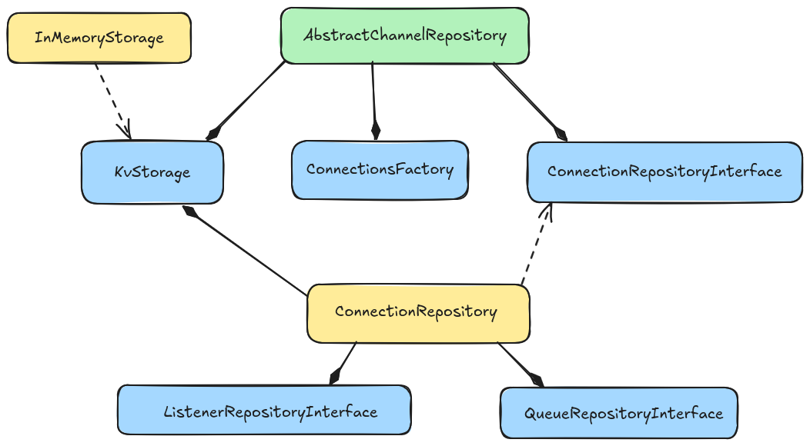

# Persistence

Base classes for channels and connections repositories.
The main idea is that a repository relies on some KV storage engine abstraction, and uses it for storing its own configuration, and its correspondant composites repositories to build final objects to return.

To build a persistence layer is needed to provide an implementation to some of above abstractions, and use them to build a custom ChannelRepository

[Here](https://github.com/laxertu/eric-redis-queues/blob/master/eric_redis_queues/repository.py) is a possible Redis implementation

**Suggestions**

If your implementation uses objects that are directly persistable by storage engine you are using, cleanest manner of implementing your custom layer is to simply
give an implementation to a [`KvStorage`](#eric_sse.repository.KvStorage) and just use it in all composite repositories.
Otherwise you should implement a dump strategy inside repositories themselves. An example is RedisQueues persistence, as Redis client used is not serializable by pickle.

# Base repositories

### *class* KvStorage

Bases: [`ABC`](https://docs.python.org/3/library/abc.html#abc.ABC)

Represents a Key Value storage engine. Provides functionalities do load, persist and find by key prefix

#### *abstract* fetch_by_prefix(prefix)

Search by KV prefix

* **Parameters:**
  **prefix** ([*str*](https://docs.python.org/3/library/stdtypes.html#str))
* **Return type:**
  [*Iterable*](https://docs.python.org/3/library/typing.html#typing.Iterable)[[*Any*](https://docs.python.org/3/library/typing.html#typing.Any)]

#### *abstract* fetch_all()

Return all items that have been persisted

* **Return type:**
  [*Iterable*](https://docs.python.org/3/library/typing.html#typing.Iterable)[[*Any*](https://docs.python.org/3/library/typing.html#typing.Any)]

#### *abstract* upsert(key, value)

Updates or inserts a value given its corresponding key

* **Parameters:**
  * **key** ([*str*](https://docs.python.org/3/library/stdtypes.html#str))
  * **value** ([*Any*](https://docs.python.org/3/library/typing.html#typing.Any))

#### *abstract* fetch_one(key)

Return value correspondant to key

* **Parameters:**
  **key** ([*str*](https://docs.python.org/3/library/stdtypes.html#str))
* **Return type:**
  [*Any*](https://docs.python.org/3/library/typing.html#typing.Any)

#### *abstract* delete(key)

Idempotent deletion. Do not throw an error on invalid key

* **Parameters:**
  **key** ([*str*](https://docs.python.org/3/library/stdtypes.html#str))

### *class* InMemoryStorage

Bases: [`KvStorage`](#eric_sse.repository.KvStorage)

In memory implementation

#### \_\_init_\_(items=None)

* **Parameters:**
  **items** ([*dict*](https://docs.python.org/3/library/stdtypes.html#dict) *[*[*str*](https://docs.python.org/3/library/stdtypes.html#str) *,* [*Any*](https://docs.python.org/3/library/typing.html#typing.Any) *]*  *|* *None*)

#### fetch_by_prefix(prefix)

Search by KV prefix

* **Parameters:**
  **prefix** ([*str*](https://docs.python.org/3/library/stdtypes.html#str))
* **Return type:**
  [*Iterable*](https://docs.python.org/3/library/typing.html#typing.Iterable)[[*Any*](https://docs.python.org/3/library/typing.html#typing.Any)]

#### fetch_all()

Return all items that have been persisted

* **Return type:**
  [*Iterable*](https://docs.python.org/3/library/typing.html#typing.Iterable)[[*Any*](https://docs.python.org/3/library/typing.html#typing.Any)]

#### upsert(key, value)

Updates or inserts a value given its corresponding key

* **Parameters:**
  * **key** ([*str*](https://docs.python.org/3/library/stdtypes.html#str))
  * **value** ([*Any*](https://docs.python.org/3/library/typing.html#typing.Any))

#### fetch_one(key)

Return value correspondant to key

* **Parameters:**
  **key** ([*str*](https://docs.python.org/3/library/stdtypes.html#str))
* **Return type:**
  [*Any*](https://docs.python.org/3/library/typing.html#typing.Any)

#### delete(key)

Idempotent deletion. Do not throw an error on invalid key

* **Parameters:**
  **key** ([*str*](https://docs.python.org/3/library/stdtypes.html#str))

### *class* AbstractChannelRepository

Bases: [`ChannelRepositoryInterface`](#eric_sse.interfaces.ChannelRepositoryInterface), [`ABC`](https://docs.python.org/3/library/abc.html#abc.ABC)

Abstract base class for channel repositories.

Builds channels before return them using injected repositories

#### \_\_init_\_(storage, connections_repository, connections_factory)

* **Parameters:**
  * **storage** ([*KvStorage*](#eric_sse.repository.KvStorage))
  * **connections_repository** ([*ConnectionRepositoryInterface*](#eric_sse.interfaces.ConnectionRepositoryInterface))
  * **connections_factory** ([*ConnectionsFactory*](entities.md#eric_sse.connection.ConnectionsFactory))

#### *property* connections_factory *: [ConnectionsFactory](entities.md#eric_sse.connection.ConnectionsFactory)*

The connections factory that will be injected into concrete channel instances.

#### *property* connections_repository *: [ConnectionRepositoryInterface](#eric_sse.interfaces.ConnectionRepositoryInterface)*

Repository to be used to persist connections.

#### *abstract static* \_channel_to_dict(channel)

Returns a dictionary representation of the channel to be passed to [`eric_sse.interfaces.ChannelRepositoryInterface.create()`](#eric_sse.interfaces.ChannelRepositoryInterface.create) calls.

* **Parameters:**
  **channel** ([*AbstractChannel*](entities.md#eric_sse.entities.AbstractChannel))
* **Return type:**
  [dict](https://docs.python.org/3/library/stdtypes.html#dict)

#### load_all()

Loads all channels

* **Return type:**
  [*Iterable*](https://docs.python.org/3/library/typing.html#typing.Iterable)[[*AbstractChannel*](entities.md#eric_sse.entities.AbstractChannel)]

#### load_one(channel_id)

Loads a channel given its it

* **Parameters:**
  **channel_id** ([*str*](https://docs.python.org/3/library/stdtypes.html#str))
* **Return type:**
  [*AbstractChannel*](entities.md#eric_sse.entities.AbstractChannel)

#### persist(channel)

Persists a channel

* **Parameters:**
  **channel** ([*AbstractChannel*](entities.md#eric_sse.entities.AbstractChannel))

#### delete(channel_id)

Deletes a channel given its it

* **Parameters:**
  **channel_id** ([*str*](https://docs.python.org/3/library/stdtypes.html#str))

### *class* ConnectionRepository

Bases: [`ConnectionRepositoryInterface`](#eric_sse.interfaces.ConnectionRepositoryInterface)

Concrete Connection Repository

Relies on [`KvStorage`](#eric_sse.repository.KvStorage) abstraction for final writes of connections data, and on
correspondant repositories for related objects ones.

#### \_\_init_\_(storage, listeners_repository, queues_repository)

* **Parameters:**
  * **storage** ([*KvStorage*](#eric_sse.repository.KvStorage))
  * **listeners_repository** ([*ListenerRepositoryInterface*](#eric_sse.interfaces.ListenerRepositoryInterface))
  * **queues_repository** ([*QueueRepositoryInterface*](#eric_sse.interfaces.QueueRepositoryInterface))

#### load_all(channel_id)

Loads all connections managed by a given channel

* **Parameters:**
  **channel_id** ([*str*](https://docs.python.org/3/library/stdtypes.html#str))
* **Return type:**
  [*Iterable*](https://docs.python.org/3/library/typing.html#typing.Iterable)[[*Connection*](entities.md#eric_sse.connection.Connection)]

#### load_one(channel_id, connection_id)

Loads a connection given the connection and channel id it belongs to.

* **Parameters:**
  * **channel_id** ([*str*](https://docs.python.org/3/library/stdtypes.html#str))
  * **connection_id** ([*str*](https://docs.python.org/3/library/stdtypes.html#str))
* **Return type:**
  [*Connection*](entities.md#eric_sse.connection.Connection)

#### persist(channel_id, connection)

Persists a connection and assign it to a channel.

* **Parameters:**
  * **channel_id** ([*str*](https://docs.python.org/3/library/stdtypes.html#str))
  * **connection** ([*Connection*](entities.md#eric_sse.connection.Connection))

#### delete(channel_id, connection_id)

Deletes a connection given the connection and channel id it belongs to.

* **Parameters:**
  * **channel_id** ([*str*](https://docs.python.org/3/library/stdtypes.html#str))
  * **connection_id** ([*str*](https://docs.python.org/3/library/stdtypes.html#str))

# Interoperability

### *class* QueueRepositoryInterface

Bases: [`ABC`](https://docs.python.org/3/library/abc.html#abc.ABC)

#### *abstract* load(connection_id)

Loads a queue given the connection id it belongs to.

* **Parameters:**
  **connection_id** ([*str*](https://docs.python.org/3/library/stdtypes.html#str))
* **Return type:**
  [*Queue*](entities.md#eric_sse.queues.Queue)

#### *abstract* persist(connection_id, queue)

Persists queue and assign to connection.

* **Parameters:**
  * **connection_id** ([*str*](https://docs.python.org/3/library/stdtypes.html#str))
  * **queue** ([*Queue*](entities.md#eric_sse.queues.Queue))

#### *abstract* delete(connection_id)

Deletes a queue given the connection id it belongs to.

* **Parameters:**
  **connection_id** ([*str*](https://docs.python.org/3/library/stdtypes.html#str))

### *class* ListenerRepositoryInterface

Bases: [`ABC`](https://docs.python.org/3/library/abc.html#abc.ABC)

#### *abstract* load(connection_id)

Loads a listener given the connection id it belongs to.

* **Parameters:**
  **connection_id** ([*str*](https://docs.python.org/3/library/stdtypes.html#str))
* **Return type:**
  [*MessageQueueListener*](entities.md#eric_sse.listener.MessageQueueListener)

#### *abstract* persist(connection_id, listener)

Persists listener and assign to connection.

* **Parameters:**
  * **connection_id** ([*str*](https://docs.python.org/3/library/stdtypes.html#str))
  * **listener** ([*MessageQueueListener*](entities.md#eric_sse.listener.MessageQueueListener))

#### *abstract* delete(connection_id)

Deleted a listener given the connection id it belongs to.

* **Parameters:**
  **connection_id** ([*str*](https://docs.python.org/3/library/stdtypes.html#str))

### *class* ConnectionRepositoryInterface

Bases: [`ABC`](https://docs.python.org/3/library/abc.html#abc.ABC)

#### *abstract property* queues_repository *: [QueueRepositoryInterface](#eric_sse.interfaces.QueueRepositoryInterface)*

#### *abstract property* listeners_repository *: [ListenerRepositoryInterface](#eric_sse.interfaces.ListenerRepositoryInterface)*

#### *abstract* load_all(channel_id)

Loads all connections managed by a given channel

* **Parameters:**
  **channel_id** ([*str*](https://docs.python.org/3/library/stdtypes.html#str))
* **Return type:**
  [*Iterable*](https://docs.python.org/3/library/typing.html#typing.Iterable)[[*Connection*](entities.md#eric_sse.connection.Connection)]

#### *abstract* load_one(channel_id, connection_id)

Loads a connection given the connection and channel id it belongs to.

* **Parameters:**
  * **channel_id** ([*str*](https://docs.python.org/3/library/stdtypes.html#str))
  * **connection_id** ([*str*](https://docs.python.org/3/library/stdtypes.html#str))
* **Return type:**
  [*Connection*](entities.md#eric_sse.connection.Connection)

#### *abstract* persist(channel_id, connection)

Persists a connection and assign it to a channel.

* **Parameters:**
  * **channel_id** ([*str*](https://docs.python.org/3/library/stdtypes.html#str))
  * **connection** ([*Connection*](entities.md#eric_sse.connection.Connection))

#### *abstract* delete(channel_id, connection_id)

Deletes a connection given the connection and channel id it belongs to.

* **Parameters:**
  * **channel_id** ([*str*](https://docs.python.org/3/library/stdtypes.html#str))
  * **connection_id** ([*str*](https://docs.python.org/3/library/stdtypes.html#str))

### *class* ChannelRepositoryInterface

Bases: [`ABC`](https://docs.python.org/3/library/abc.html#abc.ABC)

#### *abstract property* connections_factory *: [ConnectionsFactory](entities.md#eric_sse.connection.ConnectionsFactory)*

The connections factory that will be injected into concrete channel instances.

#### *abstract property* connections_repository *: [ConnectionRepositoryInterface](#eric_sse.interfaces.ConnectionRepositoryInterface)*

Repository to be used to persist connections.

#### *abstract* load_all()

Loads all channels

* **Return type:**
  [*Iterable*](https://docs.python.org/3/library/typing.html#typing.Iterable)[[*AbstractChannel*](entities.md#eric_sse.entities.AbstractChannel)]

#### *abstract* load_one(channel_id)

Loads a channel given its it

* **Parameters:**
  **channel_id** ([*str*](https://docs.python.org/3/library/stdtypes.html#str))
* **Return type:**
  [*AbstractChannel*](entities.md#eric_sse.entities.AbstractChannel)

#### *abstract* persist(channel)

Persists a channel

* **Parameters:**
  **channel** ([*AbstractChannel*](entities.md#eric_sse.entities.AbstractChannel))

#### *abstract* delete(channel_id)

Deletes a channel given its it

* **Parameters:**
  **channel_id** ([*str*](https://docs.python.org/3/library/stdtypes.html#str))

#### *abstract* create(channel_data)

Creates a new channel and configures it depending on channel_data.

* **Parameters:**
  **channel_data** ([*dict*](https://docs.python.org/3/library/stdtypes.html#dict))
* **Return type:**
  [*AbstractChannel*](entities.md#eric_sse.entities.AbstractChannel)
